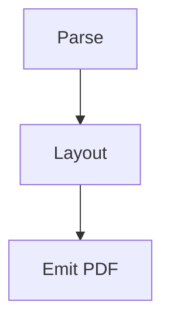

# Diagrams

sardown renders [Mermaid](https://mermaid.js.org) diagrams as real vector
graphics — not screenshots, and without launching a browser — using the
pure-Rust [merman](https://github.com/zed-industries/merman) renderer.

## Writing a diagram

Use a ` ```mermaid ` fenced code block anywhere a normal code block would
go:

````markdown

````

sardown compiles this to an SVG internally and places it as a page element,
sized to fit within the content width.

## Supported diagram types

Diagram type support depends entirely on merman's own coverage. Flowcharts
and sequence diagrams are exercised by sardown's own test suite and known to
work; consult merman's documentation for its full supported diagram set.

## When a diagram fails to compile

If a diagram's Mermaid source has a syntax error, sardown doesn't fail the
whole render — it prints a warning naming the file and the *exact* line
and column inside the diagram's own source (not just the location of the
opening ` ``` ` fence) and continues, leaving that one diagram out of the
output. For example:

```
warning: failed to render Mermaid diagram at notes.md:7:11: ...
```

points at the actual offending token on line 7 of `notes.md`, even though
the fence itself might open several lines earlier.

## Diagrams inside books

When a diagram lives inside a chapter of a book rendered with
`render-book`, warnings name the chapter's own path (as listed in
`SUMMARY.md`), not an internal synthetic ID — so you can find the file to
fix directly from the warning.

## Text rendering inside diagrams

Diagram labels need a resolvable font to shape their text (the same
font-resolution rules as everywhere else — see
[Font Resolution](./troubleshooting.md#unknown-font-family-warnings)
apply). If no usable font is available at all, a diagram's boxes and
arrows (pure geometry) still render, but its text labels may be silently
dropped instead of appearing as visible text.
